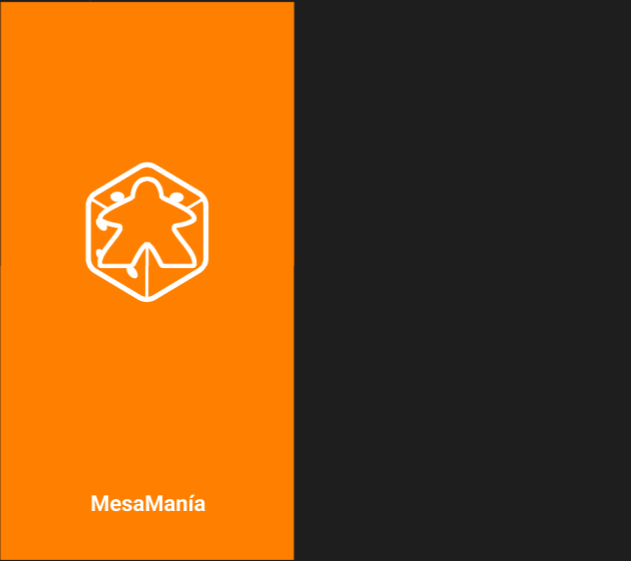
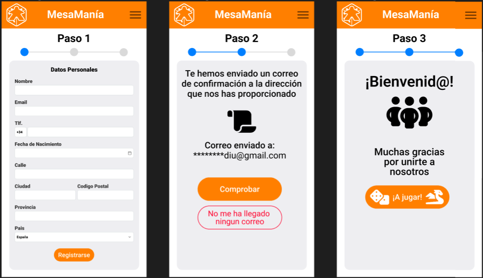
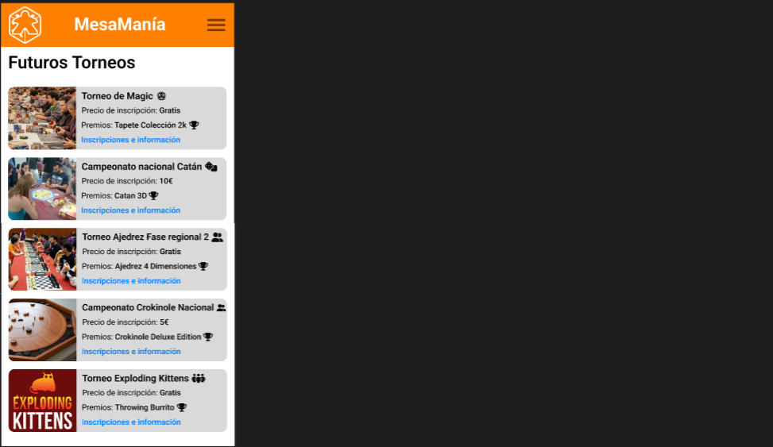
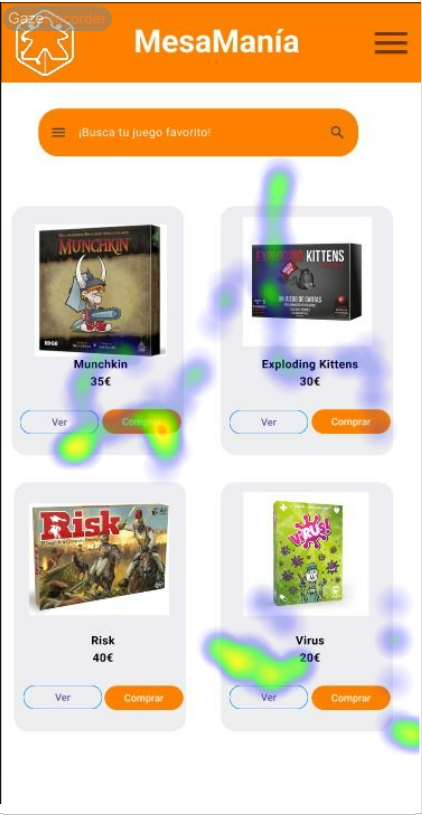
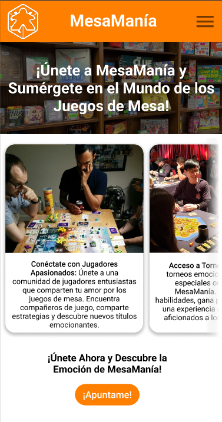
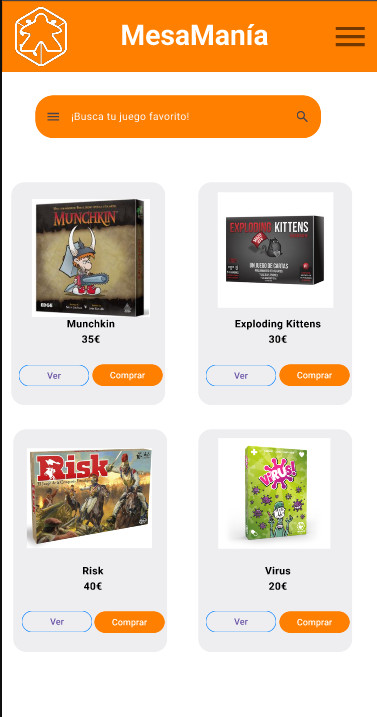
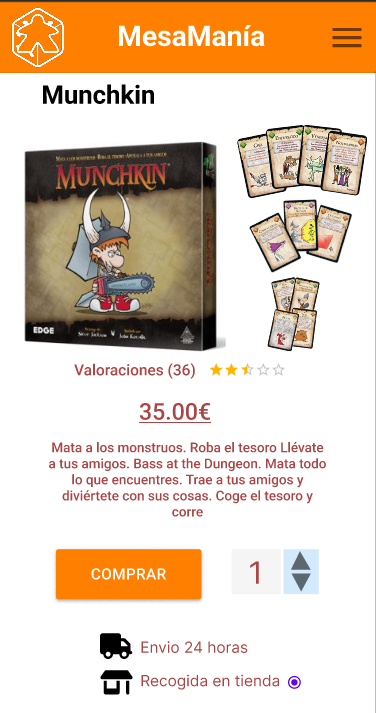

# DIU24
Prácticas Diseño Interfaces de Usuario 2023-24 (Tema: Grupos de Teatro ) 

Grupo: DIU1_bigotessucios.  Curso: 2023/24 
Updated: 19/3/2024

Proyecto: 
**MesaManía**

Descripción: 

_Somos un club de juegos de mesa que se junta de forma habitual en nuestro propio recinto. Realizamos demostraciones de juegos, torneos de cartas y otros juegos, además de contar con nuestra propia tienda.
Por otra parte, ofrecemos un servicio de alquiler de salas de juego, que incluye el propio espacio y una gran variedad de juegos de mesa. Contamos con un sistema de socios que permite una fácil inscripción a las actividades del club y otras ventajas._
 

Logotipo: 

Miembros
 * :bust_in_silhouette:  Pedro Benitez Gris    :octocat:     
 * :bust_in_silhouette:  Carlos Muñoz Barco    :octocat:

----- 

# Proceso de Diseño 

## Paso 1. UX User & Desk Research & Analisis 

 **1.a User Reseach Plan**
-----

Como objeto principal de esta práctica hemos escogido la página web de [La Estupenda](https://espaciolaestupenda.com/) . Poniendonos en la piel de los dueños del club de teatro hemos podido encontrar puntos de mejora y objetivos que nos interesaría conseguir a largo plazo y así definir de una forma mas clara estas areas de mejora. Para ello, hemos realizado este [User Research Plan](P1/UserResearchPlan.pdf).

 1.b Competitive Analysis
-----

Para este analisis de los competidores hemos elegido [La Carpinteria Teatral](https://lacarpinteriateatral.com/) y [Tengo Teatro](https://www.tengoteatro.com/) para contrastarlos con la página de La Estupenda. Hemos escogido la Carpinteria Teatral por ser granadina, 
lo que nos permite comprarar La Estupenda con otra compañia de teatro en su mismo contexto, y Tengo Teatro por ser una
compañia de teatro bastante reconocida, lo que nos permite comparar La Estupenda con otra compañia que, en principio, hace las cosas "bien".
Es facil observar que las dos compañias granadinas están bastante igualadas, pero La Estupenda sale ganando por poco. Sin embargo, ambas son considerablemente deficientes comparadas con Tengo Teatro, donde el presupuesto superior se refleja notablemente en su página web.
Si tuvieramos que destacar los puntos fuertes de cada una serían: en el caso de La Estupenda, el precio, pues es el que ofrece
los servicios mas baratos, para La Carpinteria Teatral el diseño, que pese a no ser particularmente eficaz si es destacablemente
atractivo, mientras que Tengo Teatro dispone del diseño mas intuitivo y la mayor facilidad de uso.

 1.c Persona
-----

Para esta parte nos hemos encargado de crear dos personas ficticias para entender como puede ser una persona normal que puede ser usuario de nuestra página. Para ello hemos creado un chico, Javier Martos, y una chica, Chessie Chesster, ambos jovenes que buscan algo nuevo que hacer, uno por unas razones diferentes a las del otro. Por una parte, Javier Martos es una persona joven e inmadura pero que consta con una motivación bastante sólida. Por otra parte, Chessie Chesster es una persona mas centrada pero que tiene como única motivación ocupar su tiempo libre.

 1.d User Journey Map
----

Hemos escogido estas experiencias porque nos hemos dado cuenta que para el usuario normal no acaba resultando tan intuitivo ni atractivo realizar ambas tareas, que a nuestro parecer, deben de ser las más comunes en cuanto a un grupo teatral. En ambos casos los dos personajes se encuentran con numerosos 
contratiempos fruto de la falta de funcionalidades que faciliten la experiencia de usuario (como la falta de una opción de compartir un curso por redes sociales) o de la pobre implementación de las que si son ofrecidas por la página web (como la falta de descripción en los cursos fuera de la página asociada a cada uno de ellos).

 1.e Usability Review
----
En la [Usability Review](P1/UsabilityReview.pdf) podremos ver una revisión objetivo de muchos de los aspectos de la página web donde hemos obtenido una valoración final de **53** puntos sobre 100, que según la valoración, los usuarios deberian de poder completar la mayoria de sus objetivos a pesar de carecer de una buena experiencia de usuario.

A forma de resumen, probando y analizando la página web de “La Estupenda”, pudimos encontrar áreas de mejora en esta. El User Research nos reveló que varias acciones en la página web no eran tan intuitivas, además de no llegar a ser tan atractiva y persuasiva como otras páginas que pudimos comparar en el Competitor Analysis. La creación de dos personas ficticias nos ha ayudado a ver que no solo es un usuario idealizado el que querrá hacer uso de la web, sino también a comprender las expectativas y necesidades de una persona normal al utilizar la web. Y el usability review nos ha permitido ver de forma objetiva los numerosos fallos y carencias que la página web tiene.

## Paso 2. UX Design  

 2.a Reframing / IDEACION: Feedback Capture Grid / EMpathy map 
----

Primero hemos realizado un mapa de empatía respecto a lo que un usuario normal puede sentir al respecto de nuestra propuesta

  
Nuestra propuesta de valor para un nuevo diseño es crear una aplicación web que muestre de forma legible y fluida la información que el usuario espera encontrar, creando además llamadas de acción a participar en el club e involucrarse aun más

 2.b ScopeCanvas
----
Para nuestro club, hemos realizado este scope canvas para definir en que consiste nuestro proyecto

 2.b User Flow (task) analysis 
-----

El user Map sirve para mostrar de forma visual las interacciones y caminos que un usuario puede tomar dentro de nuestra plataforma. Mientras que el task analysis nos ayudará a identificar las tareas principales y su relevancia para los
usuarios:

| Grupos de usuarios                | Jugadores competitivos | Jugadores aficionados | Principiantes / Personas que están empezando el hobby | Personas que quieren hacer amigos | Coleccionistas |
| --------------------------------- | ---------------------- | --------------------- | ----------------------------------------------------- | --------------------------------- | -------------- |
| Alquilar salas                    | M                      | H                     | L                                                     | L                                 | L              |
| Comprar juegos de mesa            | L                      | M                     | H                                                     | M                                 | H              |
| Apuntarse en torneos              | H                      | M                     | L                                                     | M                                 | M              |
| Intercambiar juegos de mesas      | L                      | H                     | M                                                     | M                                 | H              |
| Descubrir y probar juegos nuevos  | L                      | H                     | H                                                     | M                                 | H              |
| Empezar un nuevo hobby            | L                      | L                     | H                                                     | M                                 | L              |
| Asistir a eventos                 | H                      | H                     | H                                                     | H                                 | H              |
| Jugar partidas con otros miembros | H                      | H                     | H                                                     | H                                 | M              |

El user flow nos muestra los flujos muestran de forma visual la acciones que hay que llevar a cabo para realizar una actividad/tarea, y muestra las relaciones y las dependencias entre las mismas:

 2.c IA: Sitemap + Labelling 
----

 

| Término                      | Significado                                                     |
| ---------------------------- | --------------------------------------------------------------- |
| Unete al Club                | Ir al formulario de inscripción al club                         |
| Alquiler de salas            | Realizar una reserva online de una sala para jugar              |
| Torneos                      | Torneos de juegos de mesa                                       |
| Crear tu propio Torneo       | Formulario de información del torneo a crear por el usuario     |
| Unirse a un torneo existente | Formulario de inscripción a un torneo creado por otro usuario   |
| Conseguir Juegos de mesa     | Apartado de compra y cambio de juegos de mesa                   |
| Comprar juego de mesa        | Adquirir a traves del club juegos de mesa                       |
| Intercambiar juegos de mesa  | Prestar juegos de mesa a cambio de otros                        |
| Eventos                      | Eventos de juegos de mesa                                       |
| Organizar evento             | Crear un evento para una fecha determinada                      |
| Consultar eventos proximos   | Consultar los eventos próximos organizados por otros miembros   |
| Contacto                     | Pagina con informacion de contacto                              |

 2.d Wireframes
-----

## Paso 3. Mi UX-Case Study (diseño)

 3.a Moodboard
-----

A continuación se muestra el moodboard usado para la realización del proyecto. Incluye:
<ul>
  <li>Nuestra imagen de marca</li> 
  <li>Nuestro logo final</li>
  <li>Todos los logos utilizados</li>
  <li>La paleta de colores.</li>
  <li>La tipografía</li>
  <li>Imágenes de como serán los eventos e imágenes del estilo de la página</li>
</ul>

  3.b Landing Page
----
Nuestra Landing page tiene como objetivo mostrar al usuario todo lo que tenemos para ofrecer de forma clara y concisa.
Mostramos mediante una tarjeta y un texto descriptivo las 3 principales actividades del club e incitamos al usuario a unirse.

 3.c Guidelines
----
Los patrones usados en el diseño de la aplicación han sido los siguientes:

<ul>
  <li>Onboarding: pagina principal que ve un usuario al entrar en la aplicación.</li> 
  <li>Menu: menu lateral adaptado a movil para navegar por las distintas páginas de nuestra app.</li>
  <li>Carousel: carousel para mostrar las principales actividades ofrecidas por el club.</li>
  <li>Search: una barra de búsqueda para acceder de forma mas directa a cualquiera de las opciones de la aplicación.</li>
  <li>Article list: se muestra una lista de artículos mostrados como tarjetas.</li>
  <li>Item details: se muetra de forma detallada toda la información acerca de los juegos de mesa adquiribles por el usuario.</li>
 <li>Form imput: formulario para inscribirse en el club.</li>
 <li>About: una pequeña descripción acerca de quienes somos y que actividades llevamos a cabo. Además, se proporciona información acerca de se encuentra nuestro local fisicamente.</li>
 
</ul>

La pantalla de carga. Es lo primero que ve un usuario al entrar en la aplicación. Muestra el logo y el nombre del club.

La pantalla principal. Muestra mediante tarjetas y la barra de navegación todas las funcionalidades que ofrece la página. Se pueden apreciar el carrusel y el menu lateral, que facilita la navegación en movil por las distintas secciones de la aplicación.

La pantalla de registro. Sirve para unirse al club. Consta de un formulario para introducir los datos del usuario y un proceso de confirmación de correo electrónico.

La pantalla de torneos. Muestra los torneos que se celebrarán proximamente mediante una serie de cards que describe brevemente los datos mas importantes de cada uno.

El catálogo de la tienda. Muestra los distintos juegos de mesa que se pueden comprar desde la aplicación, y la pantalla de compra de uno en particular. Aqui es donde están implementados los patrones de article list y item detail, previamente mencionados.

La pantalla de información acerca del club. Ofrece información relevante para los usuarios como el e-mail de contacto o la localización de la sede del club. Corresponde al patrón about.

  3.d Mockup
----
El siguiente video muestra el funcionamiento de la aplicación. 

 3.e ¿My UX-Case Study?
-----

>>> Publicar my Case Study en Github..
>>> Documente y resuma el diseño de su producto

## Paso 4. Evaluación 

 4.a Caso asignado
----

El caso que se nos ha sido asignado dse trata de Sabor y Saber, del grupo DIU2_MiG's. Se trata de una aplicación para los amantes de cocina, funcionando como una pqueña red social donde los usuarios además de compartir sus experiencias con otros apasionados de la gastronomía, también tienen la psobilidad de acceder a clases y formaciones para especializarse más en el arte de cocinar.

[Enlace a GITHUB del proyecto](https://github.com/Angeel2003/DIU)

 4.b User Testing
----

| Usuarios | Sexo/Edad     | Ocupación   |  Exp.TIC    | Personalidad | Plataforma | TestA/B
| ------------- | -------- | ----------- | ----------- | -----------  | ---------- | ----
| Chessie Chesster | M / 21   | Jugadora profesional de ajedrez  | Basica     | Extrovertida | Web       | A 
| Javier Martos | H / 15   | Estudiante  | Media       | Social       | Web        | A 
| Ainhoa Ugartemendia  | M / 35   | Abogada     | Media        | Emocional    | Web      | B 
| Manuel Aguilar  | H / 45   | Fisico  | Media       | Racional     | Web        | B 

  4.c Eye Tracking

El objetivo de este paso es evaluar si nuestra pagina web esta bien diseñada. En concreto, queremos comprobar que la antención de los usuarios se dirige hacia donde nosotros teniamos planeado que se dirigiera.
Para ello hemos hecho uso de la herramienta web Gaze Recorder, que permite mediante el uso de la webcam registrar hacia donde se dirige nuestra mirada cuando se nos presenta una imagen delante. 
En este caso hemos recogido los datos de tres personas distintas (un usuario experto y dos usuarios objetivo) cuando se les muestra tres imagenes de nuestra página web. Analicemos ahora los resultados de cada imagen.

## Imagen 1. Pantalla principal.
En esta imagen el area de interes es el boton de apuntarse, pues el objetivo principal de esta pantalla es incitar al usuario a unirse al club.

Y estos son los resultados de los tres usuarios.

Usuario experto.

El usuario experto ha dedicado la mayor parte de su atención al boton de apuntarse y el de desplegar las opciones de la aplicacion (las tres barras). Sin embargo, practicamente ha ignorado el título y logo de la página.
La atencion de este usuario se ha dirigido principalmente a lo que teniamos planeado que fuera el area de interes, por lo que de momento el diseño cumple con su función.

Usuario objetivo 1.

El usuario objetivo 1, por su parte, ha otorgado mayor importancia al título y las tarjetas, ignorando completamente el boton de apuntarse.

Usuario objetivo 2.

El usuario objetivo 2, al igual que el 1, la mirada se ha dirigido mas hacia las tarjetas y el título que al boton de apuntarse. Claramente esto indica un fallo de diseño y es una clara muestra de que no estamos consiguiendo dirigir la atención
del usuario hacia donde nosotros queremos.

## Imagen 2. Catálogo de items.
En esta imagen las areas de interes son tanto las imagenes de los juego, pues es necesario que estas llamen la atención del usuario si queremos que los compre, y los botones de compra, pues el objetivo final de esta pantalla es incitar al usuario a adquirir un juego de mesa.

Y estos son los resultados de los tres usuarios.

Usuario experto.

El usuario experto se ha centrado mayormente en el boton de comprar, lo que era uno de los objetivos, pero apenas a dedicado tiempo a observar la imagen. Esto puede significar que esta no está lo suficientemente resaltada y por lo tanto no destaca en el diseño.

Usuario objetivo 1.

En este caso el usuario objetivo 1 también ha prestado la mayor parte de su atención a los botones de comprar y ver, pero se ha fijado también en la imagen de uno de los productos. Por lo tanto, podemos considerar que el diseño ha funcionado mejor con el usuario objetivo 1 que
con el usuario experto.

Usuario objetivo 2.

Al igual que con los dos anteriores usuarios, el usuario objetivo 2 ha dedicado su atención sobretodo a los botones de comprar y las imágenes. Esto nos indica que el diseño de esta pantalla es correcto, ya que estamos consiguiendo guiar la atención del usuario a las areas de interes.

## Imagen 3. Pantalla de compra de un item especifico.
En este caso las areas de interes son, de nuevo, el boton de compra y la imagen, pues al igual que en el caso anterior el objetivo es incitar al usuario a comprar este juego de mesa.

Y estos son los resultados de los tres usuarios.

Usuario experto.

Es facil comprobar que el usuario experto ha dedicado casi toda su atención al precio, aunque también ha observado (aunque sea brevemente) la imagen del juego y el boton de compra. Este resultado, aunque no es el esperado, tiene cierto sentido, pues el precio no es solo lo que un usuario normal suele mirar primero cuando quiere comprar un producto sino que además en nuestro diseño está bastante resaltado al ser de gran tamaño y estar subrayado.

Usuario objetivo 1.

El usuario objetivo 1 ha observado mayormente las imágenes y descripción del juego, pero ha ignorado el botón de compra y el precio. Este resultado puede significar que el botón de compra no es lo suficientemente destacable, aunque por otra parte tiene cierto sentido que un usuario
prefiera ver primero como es el juego que va a comprar antes de contemplar comprarselo.

Usuario objetivo 2.

Parecido al usuario objetivo 1, el usuario objetivo dos le ha dedicado todo su tiempo y atención a la descripción y título del juego, pero no tanto a las imágenes. De nuevo, este usuario también ha ignorado el botón de compra, quizas por las mismas razones que hemos expuesto anteriormente.

 4.d Cuestionario SUS
----

| CUESTIONARIO SUS                                                                         | Valoracion User1 (entre 1-5) | Normalizado | Valoracion User2 (entre 1-5) | Valoracion User3 (entre 1-5) | Valoracion User3 (entre 1-5) |
| ---------------------------------------------------------------------------------------- | ---------------------------- | ----------- | ---------------------------- | ---------------------------- | ---------------------------- |
| Creo que me gustará visitar con frecuencia este website                                  | 5                            | 4           | 3                            | 4                            | 3                            |
| Encontré el website innecesariamente complejo                                            | 2                            | 3           | 1                            | 2                            | 1                            |
| Pensé que era fácil utilizar este website                                                | 4                            | 3           | 5                            | 4                            | 4                            |
| Creo que necesitaría del apoyo de un experto para recorrer el website                    | 1                            | 4           | 1                            | 1                            | 1                            |
| Encontré las funciones del website bastante bien integradas                              | 4                            | 3           | 5                            | 4                            | 4                            |
| Pensé que había demasiada inconsistencia en el website                                   | 1                            | 4           | 1                            | 1                            | 2                            |
| Imagino que la mayoría de las personas aprenderían muy rápidamente a utilizar el website | 4                            | 3           | 5                            | 4                            | 4                            |
| Encontré el website muy grande al recorrerlo                                             | 2                            | 3           | 2                            | 1                            | 1                            |
| Me sentí muy confiado en el manejo del website                                           | 5                            | 4           | 5                            | 5                            | 4                            |
| Necesito aprender muchas cosas antes de manejarme en el website                          | 2                            | 3           | 1                            | 2                            | 2                            |
| VALORACION FINAL                                                                         | 85                           | 85          | 92,5                         | 85                           | 80                           |

Personalmente, aunque contemos con mayor expreiencia Tic que los usuarios que han realizado las pruebas, los resultados satisfacen nuestras espectativas y estamos conformes con estos. Pensamos que ambas aplicaciones son intuitivas y con una usabilidad sencilla

 4.e Usability Report
----

# Usability Report

#### Evaluación de usabilidad del proyecto 

### Sabor y Saber

### 28/05/2024

[Enlace a GITHUB del proyecto](https://github.com/Angeel2003/DIU)

### Realizado por:

Informe realizado por el equipo DIU1_Bigotessucios.
La página sobre crusos para amantes de la cocina la hemos encontrado sencilla, con una interfaz que muestra una usabilidad intuitiva y con la posibilidad de navegar por ella con faciidad.

## 1 DESCRIPCIÓN DEL WEBSITE

El proposito de la app es promover la pasión por la cocina a través de su página web, ofreciendo una amplia variedad de talleres personalizados y experiencias culinarias únicas. Nuestra plataforma permite a los usuarios explorar clases tanto populares como menos conocidas, así como participar en funciones interactivas como guardar recuerdos de las experiencias y seguir a otros usuarios y chefs. Nuestra estrategia se basa en la investigación de mercado y en la retroalimentación de los usuarios para ofrecer constantemente un servicio diferenciado y atractivo.

 

## 2 RESUMEN EJECUTIVO

[ Breve descripción de lo que contiene el documento 

y Resumen conciso de problemas detectados ]

Hemos utilizado varias metodologías para llevar acabo esta usability review.
Los problemas que hemos encontrado durante el testeo de la página han sido varias. Una de ellas ha sido escoger a correctos usuarios de prueba que pudiesen estar interesados por la temática de la aplicación. Otro problema que hemos encontrado ha sido en como recogeriamos los datos de las encuestas tras las pruebas de estos usuarios, ya que en esa transmisión de información tampoco sabemos las referencias sobre las que los usuarios se podrían estar basando. Por lo demás, llevar a cabo esta revisión de usabilidad no ha supuesto mayor complicación.

## 3 METODOLOGIA 

#### Metodología de usabililidad

[Metodología, sesiones,  técnicas aplicadas... ]

 

#### Test de usuarios: Participantes

[tabla, ejemplo, descripción demográfica de los participantes]

#### Resultados obtenidos

(resultado de SUS)

(resultado de eyetracking)

## 4 CONCLUSIONES 

(qué podemos extraer de conclusion con las pruebas de usabilidad efectuadas)

#### Incidencias

* (indicad si algo ha fallado o no se ha podido realizar correctamente por algún motivo)

#### Valoración 

* (Puntos Positivos a destacar)

#### Recomendaciones y propuesta de mejoras: 

* (Puntos de mejora)

#### Valoración de la prueba de usabilidad (self-assesment)

(valoración personal de si han sido útiles estas técnicas para detectar errores ocultos o falllos de usabilidad en este caso )

>>> Valoración personal 

5.) Conclusion de EVALUACION (A/B testing + usability report + eye tracking) 
----

>> recupera el usability report de tu práctica (que es el caso B de los asignados a otros grupos) 
>> con los resultados del A/B testing, de eye tracking y del usability report:
>>  comentad en 2-3 parrafos cual es la conclusion acerca de la realización de la práctica y su evaluación con esas técnicas y que habéis aprendido

## Conclusión final / Valoración de las prácticas

>>> (90-150 palabras) Opinión FINAL del proceso de desarrollo de diseño siguiendo metodología UX y valoración (positiva /negativa) de los resultados obtenidos  

